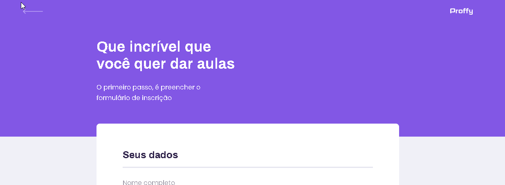

# Projeto: Proffy

 

# Descrição

Proffy é uma plataforma de ensino online, focada para quem quer estudar com professores particulares ou para que educadores se cadastrarem para dar aulas. Projeto feito na semana NLW#2, da empresa rocketseat.

 

# Tecnologias Utilizadas

Front-end

1. HTML/CSS
2. Nunjucks
3. Javascript

Back-end

1. Node.js
2. Sqlite

# Executando o projeto

1 - npm init

2 - npm install para baixar todas as dependências.

3 - npm install express.

4 - npm run dev para fazer o servidor funcionar.

5 - servidor na porta: localhost:5500

# Dependências

1 - npm install express

2 - npm install nunjucks

# Novas funcionalidades

1 - Dark mode

2 - Limite de novos horários

# Licença

:book: Licença MIT. Veja o arquivo LICENSE.